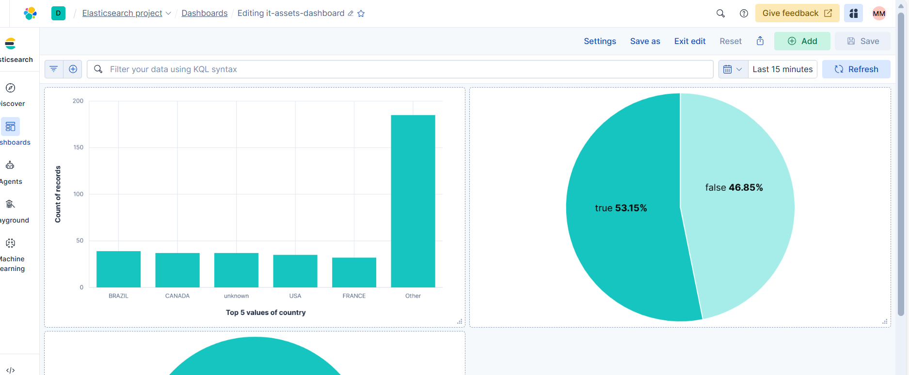

# data-operations-it-assets

Simple README explaining the two main operations used in this repo: `index` and `transform`.

## Purpose
This repository holds tools and data for managing IT asset information. Two primary operations are provided:
- `index`: discover and catalog assets (create a searchable index).
- `transform`: normalize or enrich asset records for downstream use.

---

## index
What it does
- Scans source data (files, APIs, databases) and collects asset metadata.
- Builds an index (JSON, DB table, or search index) with one record per asset.

Typical inputs
- Raw asset files (CSV, JSON, YAML)
- API responses or database queries

Typical output
- index.json (array of standardized asset records)
- Or a populated search/database index

Example (conceptual)
```
# read source data, produce index.json
index --source ./raw/ --out ./index/index.json
```

Notes
- Should deduplicate based on a stable key (asset_id, serial, or hostname).
- Include minimal required fields: id, type, owner, location, last_seen.

---

## transform
What it does
- Takes indexed records and applies transformations:
    - field normalization (e.g., hostname -> name)
    - type conversions (strings -> dates, booleans)
    - enrichment (lookups, adding tags, mapping to canonical types)
    - filtering or splitting records

Typical inputs
- index.json produced by `index`
- transformation configuration (mapping rules)

Typical output
- transformed.json or transformed dataset ready for import/analytics

## Visualizations

