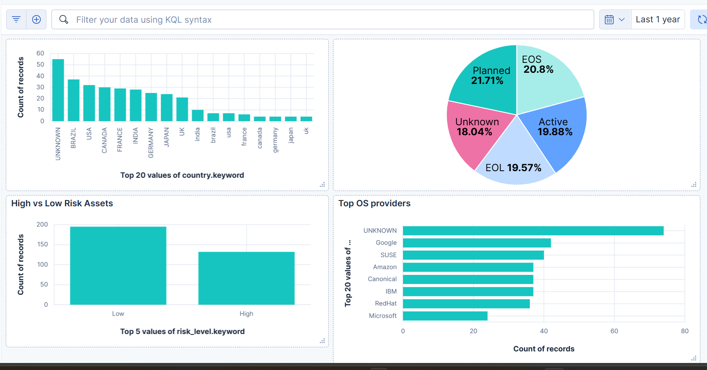
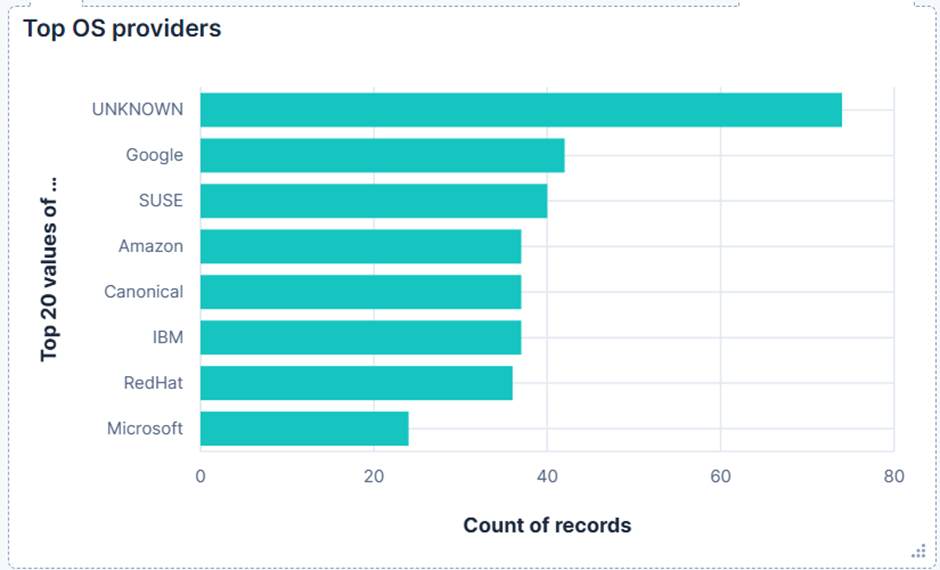

## IT Asset Data Operations 

 mini-project : cleaning raw IT asset data, indexing it into Elasticsearch, transforming and enriching it using Python, and building business insights through visualizations.

---

## PHASE 1 : Excel Data Cleaning

- Removed duplicate rows based on the `hostname` field (Data → Remove Duplicates)
- Trimmed extra spaces from text fields (using `=TRIM(A2)` or Flash Fill)
- Replaced empty cells with `Unknown` for missing values
- Standardized date format in `operating_system_installation_date` to `YYYY-MM-DD`
- Saved the cleaned data as `it_asset_inventory_cleaned.csv`

---

## PHASE 2 : Indexing Data to Elasticsearch Using Python

**Script:** `index_data.py`
- Reads `it_asset_inventory_cleaned.csv`
- Uploads all records to the `it_assets_inventory_cleaned` Elasticsearch index
- Verifies successful indexing

---

## PHASE 3 : Data Transformation & Enrichment in Elasticsearch

**Script:** `transform_data.py`
- Adds a derived field `risk_level` ("High" if lifecycle status is EOL/EOS, else "Low")
- Calculates system age in years from installation date
- Removes records with missing, blank, or 'Unknown' hostnames and (optionally) 'Unknown' OS providers
- Updates existing records with new fields using `_update_by_query`

---

## PHASE 4 : Visualization 

**Visualizations Created:**
- Assets by Country
- Lifecycle Status Distribution
- High vs Low Risk Assets
- Top OS Providers

**Screenshots:**

---

## Final Business Insights and Learnings
- A significant portion of assets are at "High" risk due to EOL/EOS status.
- Certain countries (e.g., INDIA, BRAZIL) have a higher concentration of outdated systems, indicating urgent need for OS upgrades.
- Visualizations help prioritize upgrades and focus on critical risk areas.
- Data cleaning and transformation are essential for accurate analytics and decision-making.
